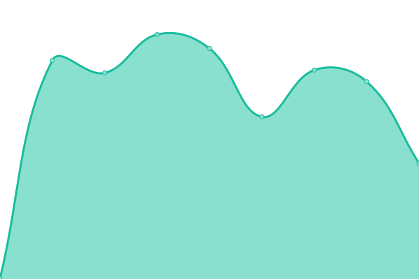
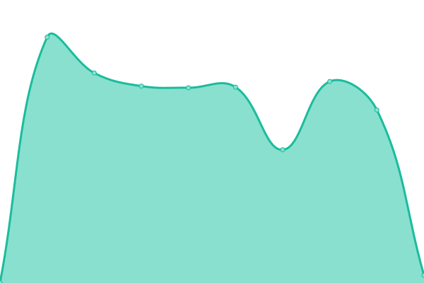

# [📈 Live Status](https://vetorial-labs.github.io/upptime): <!--live status--> **🟧 Partial outage**

This repository contains the open-source uptime monitor and status page for [vetorial-labs](https://vetorial-labs.github.io/upptime), powered by [Upptime](https://github.com/upptime/upptime).

With [Upptime](https://upptime.js.org), you can get your own unlimited and free uptime monitor and status page, powered entirely by a GitHub repository. We use [Issues](https://github.com/vetorial-labs/upptime/issues) as incident reports, [Actions](https://github.com/vetorial-labs/upptime/actions) as uptime monitors, and [Pages](https://vetorial-labs.github.io/upptime) for the status page.

<!--start: status pages-->
<!-- This summary is generated by Upptime (https://github.com/upptime/upptime) -->
<!-- Do not edit this manually, your changes will be overwritten -->
<!-- prettier-ignore -->
| URL | Status | History | Response Time | Uptime |
| --- | ------ | ------- | ------------- | ------ |
|  [Site da Vetorial](https://www.vetorial.net) | 🟩 Up | [site-da-vetorial.yml](https://github.com/vetorial-labs/upptime/commits/HEAD/history/site-da-vetorial.yml) | 

 342ms
     
 | 

<a href="https://vetorial-labs.github.io/upptime/history/site-da-vetorial">90.07%</a>
    

|  [Site da Bitcom](https://www.bitcom.com.br) | 🟥 Down | [site-da-bitcom.yml](https://github.com/vetorial-labs/upptime/commits/HEAD/history/site-da-bitcom.yml) | 

 393ms
     
 | 

<a href="https://vetorial-labs.github.io/upptime/history/site-da-bitcom">0.00%</a>
    

|  [Site da Razao](https://www.razaoinfo.com.br) | 🟩 Up | [site-da-razao.yml](https://github.com/vetorial-labs/upptime/commits/HEAD/history/site-da-razao.yml) | 

 398ms
     
 | 

<a href="https://vetorial-labs.github.io/upptime/history/site-da-razao">100.00%</a>
    

|  [MK Vetorial](https://erp.vetorial.com/mk/) | 🟩 Up | [mk-vetorial.yml](https://github.com/vetorial-labs/upptime/commits/HEAD/history/mk-vetorial.yml) | 

 55ms
     
 | 

<a href="https://vetorial-labs.github.io/upptime/history/mk-vetorial">5.47%</a>
    

|  [MK Bitcom](http://mk.bitcom.com.br/mk/) | 🟩 Up | [mk-bitcom.yml](https://github.com/vetorial-labs/upptime/commits/HEAD/history/mk-bitcom.yml) | 

 28ms
     
 | 

<a href="https://vetorial-labs.github.io/upptime/history/mk-bitcom">100.00%</a>
    

|  [MK Razao](http://mk.razaoinfo.net.br/mk/) | 🟩 Up | [mk-razao.yml](https://github.com/vetorial-labs/upptime/commits/HEAD/history/mk-razao.yml) | 

 35ms
     
 | 

<a href="https://vetorial-labs.github.io/upptime/history/mk-razao">100.00%</a>
    

<!--end: status pages-->

[**Visit our status website →**](https://vetorial-labs.github.io/upptime)

## 📄 License

- Powered by: [Upptime](https://github.com/upptime/upptime)
- Code: [MIT](./LICENSE) © [Anand Chowdhary](https://anandchowdhary.com), supported by [Pabio](https://pabio.com)
- Data in the `./history` directory: [Open Database License](https://opendatacommons.org/licenses/odbl/1-0/)
